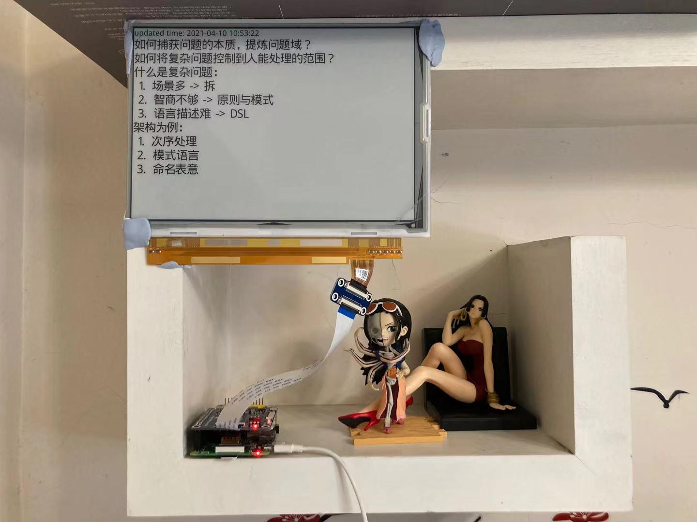

# Monitor

> Raspberry Pi with e-paper Monitor.

screen size: 1200 × 825

 - [x] MVP
    - [x] simplify IT8951 code
    - [x] with Rust
    - [x] call with Rust
    - [x] interval timer
 - [x] microsoft todo

## Setup

### Setup Raspberry Pi

setup from: https://www.waveshare.com/wiki/9.7inch_e-Paper_HAT

```
cd bcm2835-1.68
./configure
make
sudo make check
sudo make install
```

run demo code:

```
cd IT8951
make clean
make
sudo ./IT8951 0 0 01.bmp
```

### Setup Rust

```
cd generator
cargo run
```


## History Version

First Version:


Version 2:


